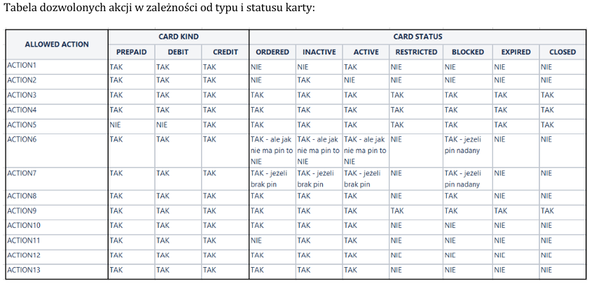

# CardService

---

## Stack

- C# / ASP.NET Core 8 (Web API)
- xUnit
- Swagger (Development)

## Struktura

- `CardService.Api` — warstwa HTTP (kontrolery, DI, logowanie, health, correlation id)
- `CardService.Domain` — modele domenowe oraz reguły dozwolonych akcji (`AllowedActionsResolver`)
- `CardService.Tests` — testy jednostkowe resolvera (przykłady z zadania + przypadki brzegowe), api oraz OperationCanceledExceptionHandler

---

## Uruchomienie

### Wymagania

- .NET 8

```bash
dotnet restore
dotnet run --project CardService.Api
```

Po starcie:

- Swagger (profil https): `https://localhost:7108/swagger`
- HTTP (profil http): `http://localhost:5295`

Sprawdzenie kondycji: 

```text
GET /health
```

## API

### Pobranie dozwolonych akcji

```text
GET /api/cards/{userId}/{cardNumber}/actions
```

```json
{
  "actions": [
    "ACTION3",
    "ACTION4",
    "ACTION9"
  ]
}
```

### Kody odpowiedzi

| Kod | Znaczenie |
|-----|-----------|
| `200` | Zwrocono listę dozwolonych akcji |
| `400` | Brak lub puste `userId` / `cardNumber` (ProblemDetails) |
| `404` | Nie znaleziono karty dla użytkownika (ProblemDetails) |

### Przykładowe wywołania (dane sample)

| userId | cardNumber | Opis | Oczekiwany wynik |
|--------|------------|------|------------------|
| `User1` | `Card17` | PREPAID + CLOSED | `ACTION3`, `ACTION4`, `ACTION9` |
| `User1` | `Card119` | CREDIT + BLOCKED | akcje zależne od PIN (indeks 19 → pin nieustawiony) |
| `User1` | `Card999` | nieistniejąca karta | `404` |

Gotowe requesty znajdują się w pliku `CardService.Api/CardService.Api.http`.

Przykład:

```bash
curl -i http://localhost:5295/api/cards/User1/Card17/actions
```

## Zachowania niefunkcjonalne

* odpowiedzi błędów w formacie ProblemDetails
* logowanie ze zmaskowanym numerem karty (bez logowania pełnego identyfikatora)
* nagłowek `X-Correlation-ID` — przyjmowany z requestu lub generowany automatycznie i zwracany w odpowiedzi
* `CancellationToken` przekazywany do `GetCardDetails`
* kolejność `actions` w JSON jest deterministyczna: rosnąco po numerze akcji (ACTION1…ACTION13)
* globalna obsługa wyjątków (`UseExceptionHandler`); anulowanie requestu obsługiwane przez `OperationCanceledExceptionHandler` (m.in. `408`)

---

## Testy

```bash
dotnet test
```

Zakres testów resolvera obejmuje m.in.:
* przykłady z treści (PREPAID/CLOSED, CREDIT/BLOCKED + PIN)
* ACTION5 tylko dla karty CREDIT
* ACTION1 tylko dla statusu ACTIVE
* reguły PIN dla ACTION6 / ACTION7 (ACTIVE oraz BLOCKED)
Zakres testów dla api objemuje m.in.:
* 200 + oczekiwane akcje dla User1 / Card17 (PREPAID + CLOSED)
* 404 dla nieistniejącej karty
* GET /health → 200
* propagację nagłówka X-Correlation-ID
Zakres testów dla OperationCanceledExceptionHandler:
* przy OperationCanceledException (bez anulowania przez klienta) zwracany jest 408 z ProblemDetails

## Architektura



1. Kontroler przyjmuje `userId` i `cardNumber`.
2. `ICardService` pobiera szczegóły karty (obecnie sample in-memory).
3. `IAllowedActionsResolver` wylicza dozwolone akcje na podstawie typu, statusu i PIN.
4. API zwraca wynik jako JSON (`AllowedActionsResponse`).

Dzięki podziałowi Api / Domain oraz interfejsom reguły biznesowe i źródło danych można rozwijać niezależnie.

---

## Świadomie pominięte / dalszy rozwój

W środowisku produkcyjnym naturalnym rozwinięciem byłoby:

* integracja z prawdziwym serwisem kart (`IHttpClientFactory`, retry/timeout/circuit breaker)
* uwierzytelnianie i autoryzacja (JWT / OIDC / IdP)
* rate limiting na publicznym API
* centralna obserwowalność (OpenTelemetry)
* Konteneryzacja (Docker) pod wdrożenie w środowisku docelowym

## Założenia

- reguły dozwolonych akcji wynikają z tabeli przekazanej w zadaniu (typ karty + status + PIN)
- implementacje `ICardService` można podmienić bez zmiany kontrolera ani warstwy Domain